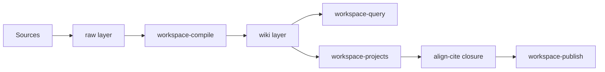

# How Second Brain works

Second Brain is a **local folder** your AI assistant helps you maintain. Company knowledge (Confluence, vendor docs, RSS, manual clips) lands in an immutable **raw** layer; an agent **compiles** curated articles into **wiki**; you author **project documentation** with citation discipline and explicit approval at every important save.

This page explains the mental model before you install or invoke your first command. You do not need to read [AGENTS.md](../../../AGENTS.md) first — that file remains the authoritative rulebook for agents.

## Three layers

| Layer | Path | Role |
|-------|------|------|
| **Raw** | `raw/` | Immutable source evidence: Confluence pages, vendor caches, RSS items, inbox clips, transcripts |
| **Wiki** | `wiki/` | LLM-curated knowledge: standards, concepts, connections, projects, Q&A |
| **Schema** | `AGENTS.md` | Operating spec agents read — approval gates, citation rules, lifecycle |

**Raw** is evidence. Once written, agents do not rewrite raw body text. **Wiki** is what you browse in Obsidian and what project agents cite. **AGENTS.md** tells agents what they may do without asking you.

Personal content (`wiki/`, most `raw/`) is typically gitignored on your machine. The repo tracks structure, prompts, scripts, and documentation.

## Compiler analogy

Think of Second Brain like a compiler pipeline:

```text
raw/           = source code (immutable input)
AI agent       = compiler (extracts, organizes, cites)
wiki/          = executable knowledge (structured, queryable)
align + lint   = test suite (citations, closure, health)
prompts/verbs  = operations you invoke in chat
```

You configure scope, invoke operations, and **approve** mutations. The agent does synthesis, cross-referencing, and bookkeeping. You read the wiki; you do not manually maintain the knowledge graph.



## Lanes

Second Brain has two **lanes** — path prefixes that separate everyday work from platform improvement:

| Lane | Prefix | Use when |
|------|--------|----------|
| **Workspace** | `workspace-*` | Ingest company docs, compile wiki, run projects, query, publish |
| **Platform** | `platform-*` | Improve Second Brain: transcripts, research review, implementation backlog |

**Workspace** is your daily documentation work. **Platform** is for product ideas about Second Brain itself. If a workspace session surfaces a Second Brain improvement idea (PH-006), escalate to platform lane — do not let the agent edit protected standards or PRD files without explicit approval.

## What agents do

When you type a slash command (e.g. `/workspace-ingest-confluence`), your IDE loads the matching prompt from `.github/prompts/`. The agent:

1. **Reads** scoped sources (`wiki/index.md`, relevant `raw/`, config) before proposing writes
2. **Proposes** file changes with citations grounded in sources
3. **Stops** at approval gates — compile batches, stage transitions, publish — until you say yes
4. **Logs** significant operations to `wiki/log.md` for audit

Agents own the wiki layer. If you edit a wiki file directly, mark `manually_edited: true` in frontmatter so agents know not to overwrite your changes blindly.

**Project chain:** `/workspace-start-project` orchestrates VP → PM → Architect (if technical) → Engineer → finalize. You review between every stage. Downstream agents honor **locked decisions** from upstream CEO gates (see [workflow-project-chain.md](workflow-project-chain.md)).

**Query:** `/workspace-query` reads `wiki/index.md` first, then relevant articles, and answers with a sources-consulted list. Retrieval guides navigation; it does not replace citation verification at publish time.

## What you approve

You are the CEO. Agents propose; you decide. Critical approval moments:

| Operation | Gate | Your response |
|-----------|------|---------------|
| Raw → wiki compile | RC-146 | Explicit y/n per batch before any `wiki/**` write |
| Project stage advance | CEO gate | Review artifact; say proceed or reopen stage |
| Publish | align-cite + align-closure | Pass checks or explicit override |
| Platform research → canonical | ADR + PIC | Approve draft ADR before stack-lift |
| Support doc regen | CEO merge | Review diff; accept sync batch |

**RC-151:** No unattended wiki compile. Background jobs may ingest raw or validate docs; wiki mutations always need you.

**Fail closed:** If the agent is unsure, it should stop and ask — not silently write.

### Retrieval vs citation

Page-index retrieval (reading `wiki/index.md` and articles) helps agents find context quickly. **Citation support** still requires reading cited paths and running `align-cite` before publish. Do not skip align because the agent "already retrieved" an article during drafting.

### Personal vs tracked content

The repo tracks prompts, scripts, ADRs, and support documentation. Your `wiki/` and most `raw/` content stays local (gitignored). Back up your vault separately if it contains proprietary company knowledge.

## Decision: where to start

| Your goal | Start with |
|-----------|--------------|
| First-time setup | [getting-started.md](getting-started.md) |
| Understand ingest | [workflow-ingest.md](workflow-ingest.md) |
| Run a project | [workflow-project-chain.md](workflow-project-chain.md) |
| Daily cheat sheet | [everyday-workflows.md](everyday-workflows.md) |
| Governance plain language | [concepts-for-operators.md](../operator-guide/concepts-for-operators.md) |

## Common mistakes

- Expecting the wiki to populate without an explicit compile approval after ingest
- Mixing platform-lane commands into everyday workspace work without escalation
- Skipping CEO review between project stages — downstream artifacts may reopen settled decisions
- Treating query answers as publish-ready citations without running `align-cite`
- Opening platform research outputs during normal workspace query — escalate intentionally, do not blend lanes
- Expecting `wiki/` to match Confluence live — raw may be fresher until re-ingest and compile

## See Also

- [getting-started.md](getting-started.md)
- [first-week-checklist.md](first-week-checklist.md)
- [operator-guide/glossary.md](../operator-guide/glossary.md)
- [AGENTS.md](../../../AGENTS.md) — complete agent rulebook

## Sources consulted

- AGENTS.md, README.md, docs/product/architecture-rationale.md, templates/workspace/routing-map.md
