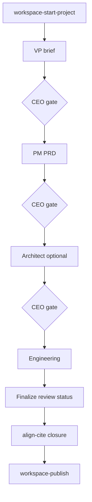

# Workflow: Project chain

**Audience:** CEOs and operators authoring multi-stage project documentation (brief → PRD → architecture → engineering → publish).

**Purpose:** `/workspace-start-project` orchestrates the agent chain. You review and approve between stages. Downstream agents honor **locked decisions** and address **forwarded open** items without re-asking settled facts.

## Terms

| Term | Meaning |
|------|---------|
| **Stage** | VP brief, PM PRD, architecture, engineering — each in `wiki/workspace-projects/{slug}/0X-{stage}/` |
| **CEO gate** | Your explicit approval before the next stage agent runs |
| **Handoff** | `handoff.md` per stage — locked decisions, open items, next steps |
| **Finalize** | Engineer step moving artifacts to `status: review` — body wikilinks removed |
| **meta.yml** | Project resumability: `current_stage`, `stage_gate`, `last_completed` |

## Stage table

| Order | Stage | Prompt | Primary artifact |
|-------|-------|--------|------------------|
| 0 | Orchestrator | `workspace-start-project` | `meta.yml`, stage dirs |
| 1 | VP brief | `workspace-vp-agent` | `01-vp-brief/product-brief.md` |
| 2 | PM PRD | `workspace-pm-agent` | `02-pm-prd/product-requirements.md` |
| 3 | Architecture (if technical) | `workspace-architect-agent` | `03-architecture/architectural-approaches.md` |
| 4 | Engineering | `workspace-engineer-agent` | `04-engineering/{specs}.md` |
| Optional | Technical writer | `workspace-technical-writer-agent` | Prose polish on artifacts |
| Optional | Architect reviewer | `workspace-architect-reviewer-agent` | Conformance report only |

Chain profiles under [templates/workspace/chain-profiles/](../../../templates/workspace/chain-profiles/) tailor stage sets (e.g. technical-doc-initiative).

## CEO gates

At each gate:

1. Read the stage artifact draft
2. Edit directly or ask agent for revisions
3. Say **Approved, proceed** (or equivalent) to lock decisions and invoke next stage
4. Orchestrator updates next stage `handoff.md` with locked + forwarded open items

Do not invoke the next agent without explicit approval — prompts enforce this.

## Handoff locks

Per [inter-stage-contract.md](../../../templates/workspace/inter-stage-contract.md):

| Type | Rule |
|------|------|
| **Locked** | CEO confirmed — downstream must not reopen |
| **Forwarded open** | Unresolved upstream — downstream must address or escalate |
| **Open (this stage)** | New local decisions |

When you approve without listing locks, orchestrator treats CEO-edited sections and explicit locked rows as locked.

**Reopen stage (PH-005):** Reopening upstream sets `invalidated_stages` — downstream artifacts marked `invalidated: true`; agents must not cite them.

## Finalize and publish

Engineer agent runs finalize:

- Removes body wikilinks (moves navigation to See Also)
- Sets `status: review`
- Prepares for `align-cite` and `align-closure`

Then see [workflow-align-and-publish.md](workflow-align-and-publish.md).

## Worked example

**Scenario:** Technical initiative "customer data replatform"

1. You: `/workspace-start-project` — declare intent; slug `customer-data-replatform`
2. VP agent drafts `product-brief.md` → `stage_gate: awaiting_ceo_review`
3. You: review, edit success criteria, say **proceed**
4. Orchestrator writes `02-pm-prd/handoff.md` with locked scope from brief
5. PM agent drafts PRD → you approve → architecture stage
6. Architect drafts approaches + tradeoffs → you approve → engineering
7. Engineer drafts specs + finalize → `status: review`
8. You: align + publish

Artifacts live under `wiki/workspace-projects/customer-data-replatform/`.

## Approval checkpoints

| Checkpoint | Your action |
|------------|-------------|
| Each stage complete | Review artifact; proceed or reopen |
| Thinking partner | Exploration only — `thinking-notes/` not publish set |
| Finalize | Confirm ready for review status |
| Publish | Separate workflow — align must pass |

## Common mistakes

- Skipping CEO gate — downstream re-asks or contradicts settled scope
- Citing invalidated artifacts after reopen
- Referencing another in-progress project from active project — closure rule violation
- Publishing from `draft` status without finalize — body wikilinks may remain

## See Also

- [workflow-align-and-publish.md](workflow-align-and-publish.md)
- [first-week-checklist.md](first-week-checklist.md)
- [ceo-approval-guide.md](../operator-guide/ceo-approval-guide.md)

## Sources consulted

- workspace-start-project.prompt.md, inter-stage-contract.md, handoff.md, project-meta.yml.md, chain-profiles/
