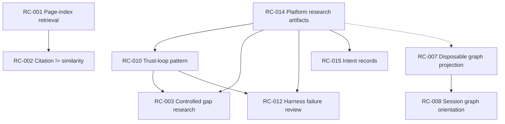

# Claim Stack Analysis - 2026-05-27

## Executive Judgment

Yes — several adopt and experiment claims **compound**. Treating them as independent tickets will over-prioritize flashy experiments and under-prioritize foundation claims that unlock safe automation. The highest-leverage path is a **stacked implementation loop**: ship foundation governance artifacts first, then run experiments only after their dependencies and validation gates exist.

## Source

- Inputs: `wiki/platform-research/claim-register.md`, `reports/platform-research-review/final-recommendations-2026-05-27.md`
- Date: 2026-05-27
- Processing limitations: lift scores are planning estimates, not measured production metrics yet.

## Claim Summary

| Layer | Role | Claim IDs |
|---|---|---|
| Foundation | Makes review, trust, and rollback possible | RC-2026-05-27-014, RC-2026-05-27-010 |
| Policy | Codifies retrieval and citation behavior | RC-2026-05-27-001, RC-2026-05-27-002 |
| Experiments | Safe trials after foundation exists | RC-2026-05-27-003, RC-2026-05-27-012, RC-2026-05-27-015 |
| Graph branch | Optional orientation tooling | RC-2026-05-27-007 → RC-2026-05-27-008 |
| Already supported | No implementation needed | RC-2026-05-27-004, RC-2026-05-27-006 |
| Deferred | Out of active queue | RC-2026-05-27-005, RC-2026-05-27-011 |

## Dependency graph

## Stack rationale

### Foundation tier

**RC-014 (platform research artifacts)** is the meta-capability that makes the rest of this batch reviewable. Without claim records, rejection history, hypotheses, and lint, you cannot run a recursive “pick → implement → test → review → rollback” loop safely.

**RC-010 (trust-loop pattern)** is the behavioral layer on top: audit trail, confidence state, fail-closed behavior, and correction handles. It is a prerequisite for any automation that proposes platform changes (gap research, harness mutation, digests).

### Policy tier

**RC-001 and RC-002** should ship as one policy bundle. Page-index retrieval defines *how* to navigate knowledge; the citation-versus-similarity rule defines *what counts as support*. Implementing graph or session-orientation experiments before this policy is codified risks optimizing the wrong retrieval semantics.

### Experiment tier

| Claim | Depends on | Why wait |
|---|---|---|
| RC-015 | RC-014 | Intent/safety fields belong on the ADR template/process, not ad hoc |
| RC-003 | RC-010, RC-014 | Gap research must not auto-mutate canonical docs |
| RC-012 | RC-010, RC-014 | Harness changes must stay advisory and approval-gated |
| RC-007 | RC-014 (soft) | Graph output must remain disposable and non-canonical |
| RC-008 | RC-007 (recommended) | Session orientation assumes a graph/summary artifact exists |

### No active implementation

- **RC-004, RC-006**: already supported by current architecture; treat as verified baseline, not backlog work.
- **RC-005, RC-011**: deferred by decision; re-enter only at scheduled re-review or explicit scope change.

## Highest-Value Claims

| Claim ID | Stack lift | Why |
|---|---|---|
| RC-2026-05-27-014 | 5 | Unblocks trust loops, experiments, and recursive review |
| RC-2026-05-27-010 | 4 | Makes automation and experiments safe |
| RC-2026-05-27-001 + RC-2026-05-27-002 | 3 | Sets retrieval/citation policy before tooling experiments |

## Highest-Risk Claims

| Claim ID | Risk if implemented out of order |
|---|---|
| RC-2026-05-27-003 | Running gap research before trust loops recreates “self-learning updates canonical docs” |
| RC-2026-05-27-012 | Auto harness mutation before advisory process erodes platform rules |
| RC-2026-05-27-008 | Session graph before disposable graph policy risks stale summaries treated as truth |

## Recommended Next Actions

1. Use `wiki/platform-research/implementation-backlog.md` as the single prioritized queue.
2. Implement one backlog item at a time using the recursive loop in `docs/platform-decision-records/DRAFT-RC-implementation-priority-loop.md`.
3. Do not start graph experiments until RC-001/002 policy ADR is user-approved.
4. Re-score the backlog after each accepted or rolled-back item.

## Protected Files Not Modified

Confirmed: this analysis did not modify canonical standards, PRD, product brief, roadmap, architecture rationale, AGENTS.md, workspace knowledge, or raw files.
